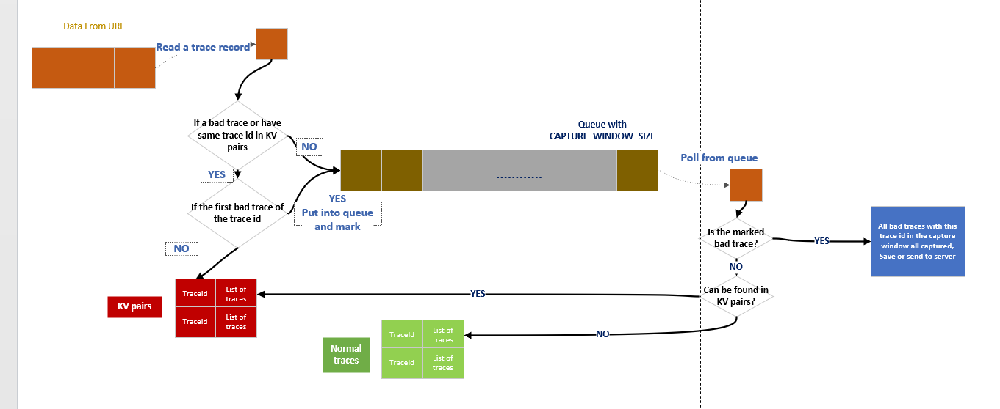

# Tail-based sampling

Distributed system trace tail-based sampling

## Introduction

Nowadays, systems not deployed on a single machine any more. The functions and modules of a system is placed in different machines, these machines may be placed separately with different hardware and the programmes running on them may be written by different groups with different programming language.

On single machine, many debug tools can be used to find bugs. However, for distributed system, it is harder to find the origin of problems, since the rpc calles between machines may be huge. So, trace track is used to record the error calls for analysis.

Currently, widely used distributed trace method are `head-based sampling` and `adaptive sampling`. However, they may miss many bad traces. `Tail-based` sampling may mitigate this problem.

## Structure

The image above is the brief struct of the program. The data are read from a URL. Trace records are splited with end line. The queue act as a buffer with `CAPTURE WINDOW SIZE`. Because a bad call in a trace may exists at the beginning, in the middle or even at the end. So we need to check records before and after current bad call. When a marked bad call is polled out of the queue, all records with same trace id are all captured. The queue size can be adjusted if you want to capture more. But capture too long period of time records is not worthwhile.

In a big system, this processor may not be only one, just like `Map-Reduce`. Records of same trace id may be assigned to different mmachine to process. So, when the end server receives bad traces from these machines, the server must call for related traces from these machines. Each machines receives call and find related records in normal traces.

Considering the memory limits of machine, memory usage need to be managed carefully. When a batch of bad traces is sent, then the sent data can be freed. Also, machines can deleted normal records after sent response to `call for related` from end server. And then one thing last is that how to drop old records in normal traces of each machine. The current implementation in the program has some problems. Please feel to issue better methods.
